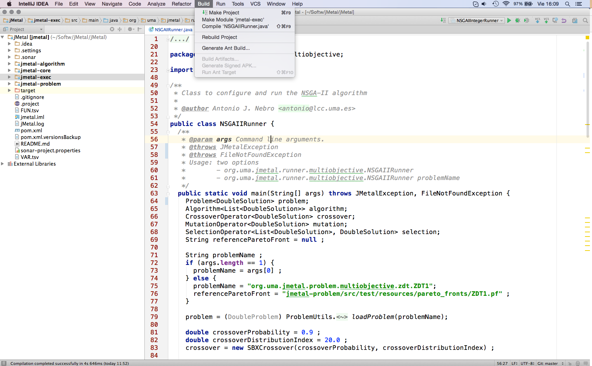
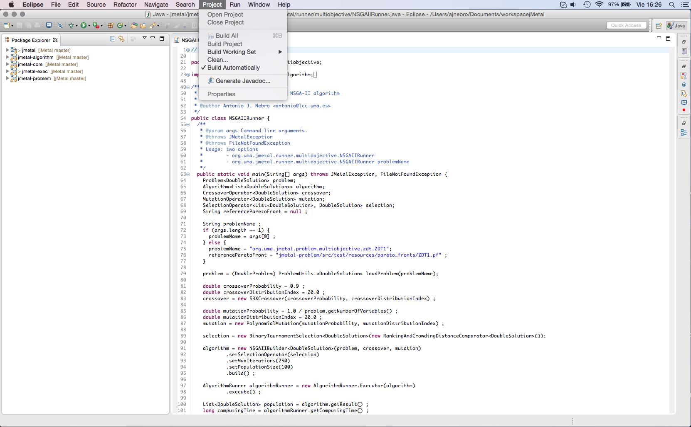
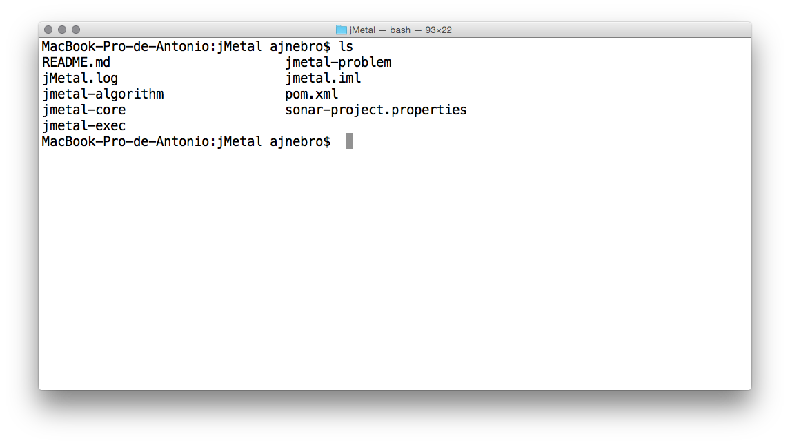

Installation steps
==================

Requirements
------------

jMetal is implemented in Java. Since version 5.2, we are using features of Java 8, so a Java 8 JDK or higher is required to compile the project.

As jMetal is a Maven project, this tool is also a requirement to compile, test and package the code.

Optionally, R and Latex are needed if you use the code to carry out experimental studies to run the R scripts and compile the Latex files that will be generated.

Compiling
---------

Once you have the source code of jMetal you can use it in to ways: from an IDE or from the command line of a terminal. The IDE alternative is the simplest one and, if you are used to the tool, compiling and running algorithms is easy.

IntelliJ Idea
~~~~~~~~~~~~~

To build the project you have to select `Build` -> `Make Project`

Eclipse
~~~~~~~

If the `Project` -> `Build Automatically` is set, Eclipse will automatically build the project. Otherwise,  select  `Project` -> `Build Project`

Netbeans
~~~~~~~~

In Netbeans you have to select `Run` -> `Build Project`

.. figure:: _static/BuildNetbeans.png
   :alt: Building with Netbeans

Building from the command line
~~~~~~~~~~~~~~~~~~~~~~~~~~~~~~

Once you have downloaded the source code you can use the command line to build the project by using Maven commands. If you open a terminal you will have something similar to this:

Then you have Maven to your disposal to work with the project:

* `mvn clean`: cleaning the project
* `mvn compile`: compiling
* `mvn test`: testing
* `mvn package`: compiling, testing, generating documentation, and packaging in jar files
* `mvn site`: generates a site for the project
